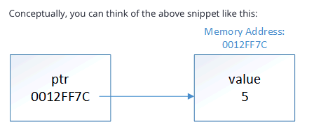

# Chapter 12.7 Introduction to pointers

This folder contains materials for Chapter 12.7 Introduction to pointers.


Pointers should be nothing to be scared of. Pointers are famous creatures in C. They arent that complex, but they were often abused in weird ways to use pointers make them hard to use. If you avoid stupid ways to use pointers, they are fairly easy/ 

Consider a normal variable is like 

```c++
char x {};
```

When code genereated for this definition is executed, piece of memory of RAM will be assigned to this object. For the sake of example lets say `x` is assigned to memory address `160`. Whenever we use variable `x` in an expression, the program will go to memory address `160` to access the value stored there.


## What are pointers?

Conceptually we can think like this



This is where pointers get their name from -- ptr is holding the address of x, so we say that ptr is “pointing to” x.


Pointers in C++ is special type of variable that holds or stores memory address of another variable instead of storing a direct value. Rather than hold actual data like `int` and `char`, a pointer **points** to the location in memory where that data is located.

Every variable in a program is stored at a unique memory address, and pointers give us a way to directly work with those addresses. This makes them extremely powerful for tasks like dynamic memory allocation, efficient array traversal, and giving functions the ability to modify data stored elsewhere. Conceptually, this is similar to pass-by-reference, but it is done explicitly using memory addresses.

## Declaring pointerd and initialization of pointer

We must both declare and initialize pointer in a correct way. A declared pointer but not initialized, may point to an undefined memory location, often called garbage memory, which indicates leftover or unpredictable values dtored in location. If we access such memory it will lead to unpredicatable behavior and program crashed.

### Declaring pointer
The arterisk (*) has 2 diff meaning in C++

```c++
data_type* ptr_name;
```

or

```c++
data_type *ptr_name;
```

- When used in a declaration (int* ptr;), it informs the compiler that this variable is a pointer.

- When used in an expression (*ptr), it dereferences the pointer—i.e., accesses the value stored at the memory address the pointer holds.

### Initializing pointer in C++

There are 2 ways to initialize a pointer

Pointers not initilized by default. A pointer that has not been initialized is called a wild pointer. A wild pointer contains a garbage address, and dereferencing a wild pointer will result in undefined behavior. Because of this you should have initialize pointers to a known value.

> Best practice: always initialize your pointers


1. Assigning an existing variables address

The most common way to initialize a pointer is by storing the address of an already declared variable. This directly links the pointer to that variable’s memory location, allowing us to access or modify its value through the pointer using dereferencing:

```c++
int num = 20; 
int* ptr = &num;                // Pointer initialized with address of num 
cout << *ptr << endl;     // Dereferencing ptr to access the value of num 
*ptr = 30;                            // Dereferencing ptr to modify the value of num 
cout << num << endl;  // Output: 30 
```


In this example, ptr points to the memory location of num, denoted using &num. The & operator (known as the reference operator) is used to retrieve the memory address of the num variable. The *ptr syntax dereferences the pointer, allowing us to read or write the value stored at that address.

2. Using nullptr

Sometimes we need to declare a pointer in advance, even if we don’t yet have a variable for it to point to—for example, when a pointer will later be assigned dynamically allocated memory or a value returned by a function. In such cases, we should initialize the pointer with nullptr. This prevents it from pointing to random memory and makes it safer to check before using it:

int* ptr = nullptr; // Safe initialization, does not point anywhere 

Copy to clipboard

If we attempt to dereference a null pointer, the program will typically crash or throw a runtime error instead of silently reading or writing garbage memory. This makes bugs easier to detect. By initializing a pointer with nullptr, we ensure it doesn’t accidentally access random memory, and we can safely check whether it points to a valid location before using it:

```c++
if (ptr != nullptr) { 
    *ptr = 10; // Safe only if ptr points to valid memory 
} 
```


